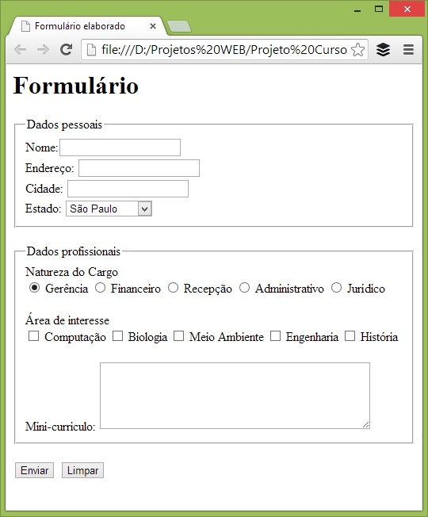

## Execício 3 - 

### Detalhamento do clone

1. Para o cabeçalho, utilizou-se as tags header e h1 para a palavra Formnulário.
2. Para o rótulo dos Dados Pessoais, foram utilizadas as tags fieldset e, dentro dela legend. Este conjunto já permite a inserção da moldura no HTML.
Usando a tag label foi possível estabelecer os campos de nome e endereço através da tag input - type"text". Embora não tenha ficado claro se houve limitação de caracteres para os campos, é conveniente a colocação. Como tratam-se de dados importantes, o atribuo riquered fora aplicado.
Para a seleção do Estado, o uso da tag label, seguida de select e option resolveram este campo.
Novamente o uso da tag fieldset seguida de legend possibilitou a moldura na seção de Dados Profissionais.
Com uso do input type radio, foi possível que se selecionasse a Natures do Cargo.
Já com o checkbox o usuário define a Área de Interesse. No visual o type radio deixa os marcadores em círculo e o checkbox em formato quadrado.
O label para o Mini-currículo e o textarea para a inserção do texto, com limitação de linhas e colunas.
Por fim, os botões type reset e submit para a limpeza e envio do formulário.

